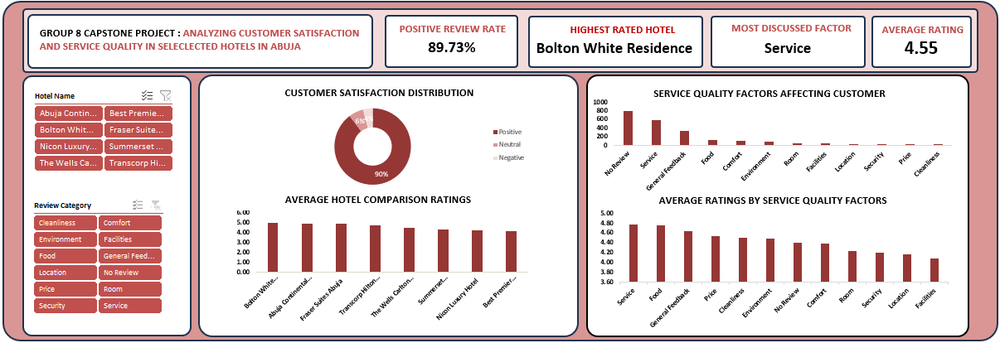

# Analyzing Customer Satisfaction and Service Quality in Selected Hotels in Abuja

A data analysis project examining customer satisfaction and service quality
across eight hotels in Abuja, Nigeria, based on over 2,150 customer reviews
scraped from Google Maps.



## Project overview

Customer satisfaction drives loyalty, reputation, and business success in the
hotel industry. This project analyzes guest reviews and ratings from eight
hotels in Abuja to identify the factors that most strongly influence customer
satisfaction, compare hotel performance, and surface insights hotel managers
can act on.

**Hotels covered:** Summerset Continental, Fraser Suites Abuja, Transcorp
Hilton Abuja, Abuja Continental, Best Premier Maitama Residence, Nicon
Luxury, The Wells Carlton, and Bolton White Residence.

**Tools used:** Microsoft Excel (pivot tables, charts, dashboard, data
cleaning formulas).

## Objectives

- Examine the general level of customer satisfaction across the selected hotels.
- Identify the major factors influencing customer satisfaction.
- Compare service quality across hotels.
- Evaluate the relationship between service quality and hotel ratings.

## Repository structure

```
├── data/
│   ├── raw/            # Original scraped reviews, unmodified
│   └── processed/      # Cleaned, categorized dataset used for analysis
├── analysis/           # Excel workbook: cleaning, pivot analysis, dashboard
├── presentation/        # Slide deck summarizing methodology & findings
├── images/             # Dashboard export used in this README
├── docs/                # Data quality log detailing every cleaning decision
└── README.md
```

## Methodology

1. **Collection** — Reviews and star ratings scraped from Google Maps listings for each hotel.
2. **Cleaning** — Removed unusable rows, standardized text casing, translated non-English reviews, and resolved missing values. Full decision log in [`docs/data-quality-log.md`](docs/data-quality-log.md).
3. **Categorization** — Each review tagged with a `Review Category` (Service, Food, Room, etc.) and a `Guest Perception` (Positive / Neutral / Negative).
4. **Analysis** — Pivot tables and charts built in Excel to summarize sentiment distribution, category frequency, and per-hotel/per-factor average ratings.
5. **Dashboard** — Interactive Excel dashboard with slicers for hotel and review category (screenshot above; live version in [`analysis/abuja-hotel-data-and-dashboard.xlsx`](analysis/abuja-hotel-data-and-dashboard.xlsx)).

## Key findings

- **Overall satisfaction is high**: 90% of reviews expressed positive sentiment, 6% neutral, 4% negative.
- **Service is the biggest driver of satisfaction**: it's the most-discussed factor (586 reviews) and among the highest-rated (avg. 4.78/5), alongside Food (avg. 4.76/5).
- **Lower-rated areas**: Facilities (4.09), Location (4.15), Security (4.18), and Room Quality (4.24) scored comparatively lower — these are the clearest opportunities for improvement.
- **Bolton White Residence** had the highest positive review rate among the eight hotels analyzed.
- Across hotels, "Excellent" was the most common rating category, with "Poor" and "Fair" ratings relatively rare.

Full walkthrough of findings, charts, and recommendations: [`presentation/customer-satisfaction-hotels-abuja.pptx`](presentation/customer-satisfaction-hotels-abuja.pptx).

## Recommendations

- Invest in continuous staff training to improve service delivery.
- Monitor customer feedback regularly to catch service gaps early.
- Give more attention to food quality, comfort, and environmental conditions.
- Use customer reviews systematically to improve guest experience and loyalty.
- Adopt data-driven strategies for ongoing service improvement.

## Data & privacy note

The raw and cleaned datasets include guest names and review text originally
posted publicly on Google Maps. The content was public at the time of
collection, but if you fork or reuse this repository, consider whether you
want to anonymize the `Name` column before republishing, since it still
contains identifiable individuals.

## License

The analysis, code, and documentation in this repository are released under
the [MIT License](LICENSE). The underlying review data originates from
publicly posted Google Maps reviews and is included for research and
portfolio purposes; it is not original work of this project's author.

## Author

Prepared as a capstone data analysis project, June 2026.
